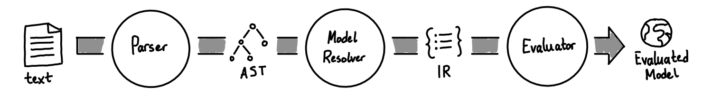

# Oneil Architecture

The model for the Oneil architecture is a linear model.

- The **parser** converts **text** into an **abstract syntax tree (AST)**
- The **model resolver** resolves a collection of **ASTs** into an **intermediate representation (IR)**
- The **evaluator** evaluates an **IR** and produces an **evaluated model**

This is the basic structure of the system. Each component is broken into an individual crate.

- [`oneil_parser`](../../src-rs/oneil_parser/) - contains a recursive descent
  parser for the [Oneil grammar](../specs/grammar.ebnf)

- [`oneil_ast`](../../src-rs/oneil_ast/) - contains the data structures for the
  Oneil AST

- [`oneil_model_resolver`](../../src-rs/oneil_model_resolver/) - contains the
  model resolver, which connects a model and its dependencies

- [`oneil_ir`](../../src-rs/oneil_ir/) - contains data structures for the Oneil
  IR

- [`oneil_evaluator`](#) - (WIP) contains the code for evaluating the IR

Other crates include:

- [`oneil_error`](../../src-rs/oneil_error) - contains an abstract error that
  other errors can be converted to; used for consistent CLI error styling

- [`oneil`](../../src-rs/oneil/) - implements the CLI for Oneil

For more details about what each crate does, how it operates, patterns used,
etc., see the crate's `README`.