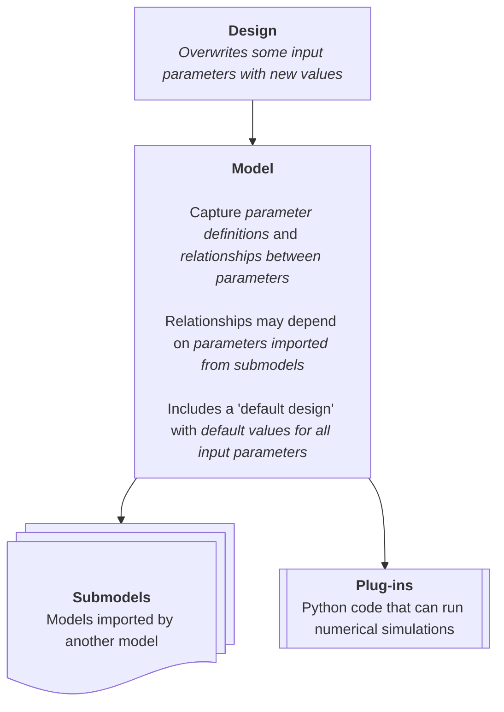

# Overview

Oneil is a design specification language for rapid, comprehensive system
modeling.

Traditional approaches to system engineering are too cumbersome for non-system
engineers who don't have all day. Oneil makes it easy for everyone to contribute
to the central source of system knowledge. With Oneil everyone can think like a
system engineer and understand how their design impacts the whole.

Oneil enables specification of a system *model*, which is a collection of
*parameters*, or attributes of the system. The model can be used to evaluate any
corresponding *design* (which is a collection of value assignments for the
parameters of the model). In addition, models may have *submodels*, which are
models representing a subsystem.



Here is a quickstart on Oneil syntax. A more in-depth exploration of Oneil can
be found in the chapters that follow.

## Simple parameter

A basic parameter has the shape `Name: identifier = value`.

```oneil
Window count: n_w = 20
Space domain: D_s = 'interstellar'
```

Here `Retry count` / `Space domain` are names, `n_retry` / `D_s` are identifiers
(symbols), and `20` / `'interstellar'` are values.

Parameters that are directly assigned values are referred to as "independent
parameters".

## Limits

Limits can be used to constrain a parameter to a set of allowed values. By
default, Oneil allows a parameter to have values from 0 to infinity.

Continuous limits are specified after the name with the syntax `(min, max)`.
Any value between `min` and `max` is a valid parameter value.

```oneil
Battery efficiency (0, 1): eta = 0.90
Azimuth look angle (0, 2*pi): psi = pi
```

Discrete limits are specified with the syntax `[value1, ..., valueN]`. Only the
values specified in the limit are valid values.

```oneil
Battery array configuration ['series', 'parallel']: config = 'series'
```

## Notes

There are times you may want to add more information to a parameter, such as
references, or an explanation of the calculation. To add documentation to a
parameter, use `~` for a single-line note or wrap the text in `~~~` for a
multi-line note.

Notes support inline LaTeX.

```oneil
Cylinder radius: r = d/2 :km

    ~ Distance from the center to the inner rim.

Artificial gravity: g_a = r*omega^2 :m/s^2

    ~~~
    The position of a point on the rim of a rotating cylinder is:

    $\vec{r}(t) = r\cos(\omega t)\,\hat{i} + r\sin(\omega t)\,\hat{j}$

    Taking the first derivative gives the velocity:

    $\vec{v}(t) = \frac{d\vec{r}}{dt} = -r\omega\sin(\omega t)\,\hat{i} + r\omega\cos(\omega t)\,\hat{j}$

    Taking the second derivative gives the acceleration:

    $\vec{a}(t) = \frac{d\vec{v}}{dt} = -r\omega^2\cos(\omega t)\,\hat{i} - r\omega^2\sin(\omega t)\,\hat{j} = -\omega^2\vec{r}(t)$

    The acceleration points radially inward (toward the center), and its magnitude is:

    $|\vec{a}| = r\omega^2$

    This centripetal acceleration acts as artificial gravity for inhabitants
    standing on the inner rim of the cylinder, so $g_a = r\omega^2$.
    ~~~
```

## Units

A defining feature of Oneil is that it ensures that unit arithmetic is correct,
and it performs automatic conversions when needed.

To assign a unit to an independent variable, add `:<unit>` to the parameter.

```oneil
Earth's gravity: g_E = 9.80664 :m/s^2
Earth rotation period: T_E = 23.9344696 :hr
```

Note that limits are always assumed to be in terms of the parameter's unit.

```oneil
Servo position (0, 360): p = 180 :deg
```

## Intervals

Oneil also allows a parameter to represent a range of values, known as an
*interval*. Intervals are represented using the syntax `min | max`.

```oneil
Ambient temperature: t = 249 | 305 :K
Battery efficiency: eta = 0.8 | 0.9
```

To get the minimum and maximum value of an interval, use the `min` and `max`
functions.

```oneil
Max ambient temperature: t_max = max(t)
Min battery efficiency: eta_min = min(eta)
```

## Comments

Comments in Oneil are the same as comments in Python. They start with a `#` and
go until the end of the line. Comments are ignored by Oneil

```oneil
# TODO: verify that this number is accurate
Satellite mass: m_sat = 0.5 :kg
```

## Dependent parameters

A parameter can reference other parameters in the model. This is referred to as
a *dependent parameter*.

```oneil
Earth's gravity: g_E = 9.81 :m/s^2
Rocket mass: m = 2e6 :kg

Minimum thrust required: thrust_min = m * g_E :N
```

Dependent parameters can also use intervals.

```oneil
Power consumption: P_c = eta_c * P_q | eta_c * P_a
# or, more simply
Power consumption: P_c = eta_c * (P_q | P_a)
```

## Tests

Use *tests* to verify that a requirement is met.

```oneil
Body length: l_body = 0.25 :m
Antenna length: l_ant = 0.1 :m

Maximum length: l_max = 0.5 :m

test: l_body + l_ant <= l_max
```

Tests can also be annotated with notes.

```oneil
Earth's gravity: g_E = 9.81 :m/s^2
Artificial gravity: g_a = 9.79 :m/s^2

test: g_E*0.9 <= g_a <= g_E*1.1
    ~ Artificial gravity should be within 10% of Earth's gravity
```

## Importing Python

Oneil allows users to import python code so that models can perform repetetive calculations or more complex calculations such as simulations. Import python code by using the syntax `import <python_file>` where `<python_file>` is the path to the python file without `.py`, relative to the model file. The path may include folders (`import ../functions`, `import lib/helpers`), matching `submodel`. Functions from that file can then be used in expressions.

```oneil
import sphere_math

Earth radius: r_E = 6371 :km

Earth surface area: A_E = sphere_surface_area(r_E) :km^2
Earth volume: V_E = sphere_volume(r_E) :km^3
```

```py
# sphere_math.py

import math

def surface_area(radius):
    """Return surface area of a sphere."""
    return 4 * math.pi * radius_km ** 2

def volume(radius):
    """Return volume of a sphere"""
    return (4/3) * math.pi * radius_km ** 3
```

Units are handled automatically by mathematic operators in Python.

## Fallback Operator

When a python function may error, the `<python_call> ? <fallback_value>` can be
used to provide a fallback value.

```oneil
Boiling point of water: bp_water = flaky_simulation() ? 373.15 :K
```

Check out [Oneil's Python API](./a-python-api.md) for more details on how to use Oneil with Python.

## Model imports

Models can import other models as **submodels** using `submodel <file> as <alias>`.
Parameters from the imported model are accessed as `parameter.alias`.

```oneil
# satellite.on
submodel battery
submodel magnetometer as m
submodel radar as r

Satellite peak power: P_max = P_max.m + P_max.r :W

$ Battery usage: U_B = P_max / load_max.battery :%
```

```oneil
# battery.on
Maximum load: load_max = 120 :W
```

```oneil
# magnetometer.on
Magnetometer peak power: P_max = 20 :W
```

```oneil
# radar.on
Radar peak power: P_max = 2 :W
```

A *submodel* correlates to a *subsystem* of the system being modeled. When you
need to read from a model but don't want to treat it as a subsystem, use
`reference <file> as <alias>` instead.

```oneil
# orbit.on
reference constants as c

Altitude of satellite: h = 500 :km
$ Radius of orbit: r = h + R_E.c :km
```

```oneil
# constants.on
Earth radius: R_E = 6356752 :km
```

## Designs

A *design* allows you to change or augment parameters of a model to represent
an alternative configuration. Designs are written in `.one` files and can be
applied to a model at the command line, to a model from a design using `apply <design> to <alias>`, or imported like a regular model `submodel <design> as <alias>`.

```oneil
# mars.one
design planet

g = 3.72 :m/s^2
```

```oneil
# mission.on
submodel mars as p

Spacecraft mass: m = 500 :kg
Surface weight: W = m * g.p :N
```

See [Designs](./10-designs.md) for the full reference.
