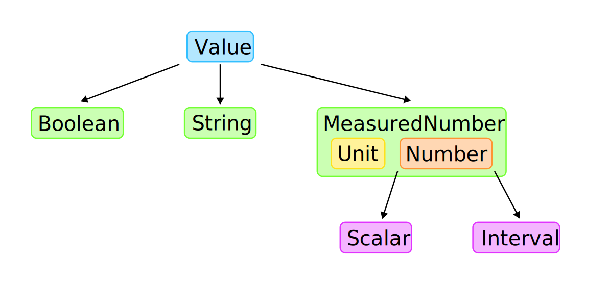

# Oneil Evaluator

This module performs the typechecking and evaluation of Oneil models.


## Oneil Values

An Oneil value can either be a `Boolean`, a `String`, or a `MeasuredNumber`. This
is defined in [`value/value_impl.rs`](src/value/value_impl.rs).

A `MeasuredNumber`, as defined in [`value/number.rs`](src/value/number.rs), is
composed of a `Unit` and a `Number`.

A `Number`, also found in [`value/number.rs`](src/value/number.rs), can either be
a `Scalar`, which has a single `f64` value, or an `Interval`, which has a min and
a max `f64` value.



Each level has operations defined on it that performs checks appropriate to its level.
Operations defined on `Value` check that the value is the correct type (`Boolean`,
`String`, `MeasuredNumber`). Operations on `MeasuredNumber` check that `Unit`s are
correct. Operations on `Number` checks the expected number type (`Scalar`/`Interval`).

For example, `Value` has a `Value::checked_add` operation, which checks to make sure
that both values are a `MeasuredNumber`, then calls the `MeasuredNumber::checked_add`
operation. `MeasuredNumber::checked_add` checks to make sure that both numbers have
the same units, then calls `Number::add`. `Number::add` handles whether the right-
and left-hand sides are `Scalar` and/or `Interval`.

Note that `Interval` operations are based on the research done on the topic, as well
as the [`inari` crate](https://crates.io/crates/inari). A writeup of the research can
be found in
[`docs/research/2025-11-13-interval-arithmetic-paper-review.md`](../../`docs/research/2025-11-13-interval-arithmetic-paper-review.md).
We do not use the `inari` crate directly because it is specialized to certain CPUs.


## Float Comparison

Oneil uses `f64` to represent its values. Because of the way that floating point works,
[comparison does not always produce the expected result](https://floating-point-gui.de/errors/comparison/).
For example, [`0.1 + 0.2 != 0.3`](https://play.rust-lang.org/?version=stable&mode=debug&edition=2024&gist=0610a3521f8f8b8747258fb21adc0744).

For this reason, Oneil uses an `is_close` function that checks if floats are equal
with a degree of uncertainty. This function uses absolute or relative uncertainty
depending on the context. For more details, see the implementation in
[`value/util.rs`](src/value/util.rs).


## Unit Handling

Numbers in Oneil are represented as a `MeasuredNumber`, which has a `Unit` and
a `Number`. A unit is a map of 7 dimensions, as defined in the `Dimension` enum
in [`value/unit.rs`](src/value/unit.rs), with associated *base units*.

| Dimension                      | Base Unit |
|--------------------------------|-----------|
| `Dimension::Mass`              | kilogram  |
| `Dimension::Distance`          | meter     |
| `Dimension::Time`              | second    |
| `Dimension::Temperature`       | Kelvin    |
| `Dimension::Current`           | Ampere    |
| `Dimension::Information`       | bit       |
| `Dimension::Currency`          | USD       |
| `Dimension::Substance`         | mole      |
| `Dimension::LuminousIntensity` | candela   |

The unit map associates each `Dimension` with an `f64` that represents the
exponent value. So, for example, the dimension `kg*m/s^2` would be
represented as:

```js
{
	Mass: 1.0,
	Distance: 1.0,
	Time: -2.0,
	// all other dimensions are zero
}
```

A `MeasuredNumber` is considered "unitless" if all of its dimensions are equal
to zero.


### `SizedUnit`

Oneil allows users to use units that have a defined magnitude, such as `km`,
which is `1000 m`. Therefore, when a parameter unit is evaluated, a `SizedUnit` is
returned. A sized unit has a `magnitude` and a `unit`. As an example, `km/hour`
is `1000 m / 3600 s` and would therefore be stored as

```js
{
	magnitude: 1000 / 3600,
	unit: {
		Distance: 1.0,
		Time: -1.0,
	}
}
```

Notice that Oneil values themselves do *not* use `SizedUnit`s. Instead, if a
parameter's value is "unitless", it is assigned the parameter's unit and
multiplied by the parameter's magnitude. So

```oneil
My value: x = 10 :km
```

is essentially translated to 

```oneil
My value: x = 10 * 1000 :m
```

The magnitude applied to the value is stored with the parameter for display purposes
later.

This decreases the complexity of the `MeasuredNumber` implementation.


## Builtins

As a part of evaluation, Oneil has the ability to provide "builtins" to the user.
These builtins include builtin values, functions, units, and prefixes. Builtins can
be defined by the user of the `oneil_eval` crate, as reflected by the `BuiltinMap`
trait in [`builtin/mod.rs`](src/builtin/mod.rs).

Note that builtin units are stored as `Rc<SizedUnit>` rather than `SizedUnit` since
a unit can have multiple names. For example, "in", "inch", and "inches" all refer
to the same unit.

This crate provides a "standard library" of builtins in
[`builtin/std.rs`](src/builtin/std.rs).


## Fuzz Testing

Interval arithmetic is difficult to get right, so we use
[fuzz testing](https://en.wikipedia.org/wiki/Fuzzing) to test properties
of interval arithmetic, such as "interval arithmetic should always produce
a valid interval".

Fuzz test targets are found in the [`fuzz/fuzz_targets`](fuzz/fuzz_targets/) directory,
with shared data structures and code in [`fuzz/shared`](fuzz/shared/).

In order to run the fuzz tests, you will need to install the nightly compiler and
`cargo-fuzz`.

```bash
$ rustup install nightly
$ cargo install cargo-fuzz
```

To run the fuzz tests, run

```bash
cargo +nightly fuzz run <fuzz-target>
```

where `<fuzz-target>` is the name of the target, such as
`single_op_inclusion_property`. This will run the fuzz test either
until it finds an input that causes the test to panic or until
you stop it with `Ctrl+C`.

For more details on fuzzing,
see the [*Rust Fuzz Book*](https://rust-fuzz.github.io/book/cargo-fuzz/setup.html).

